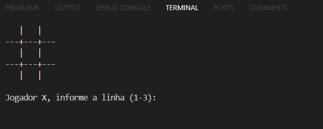
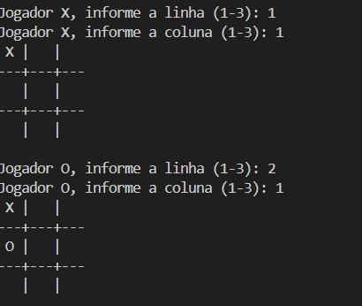
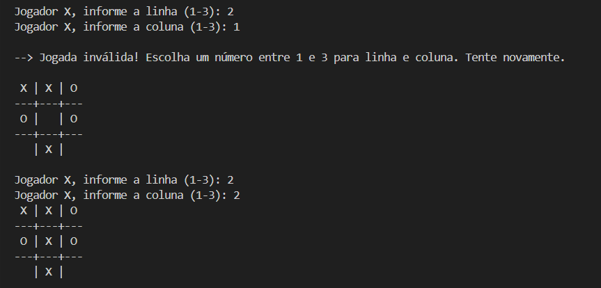
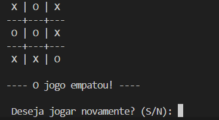
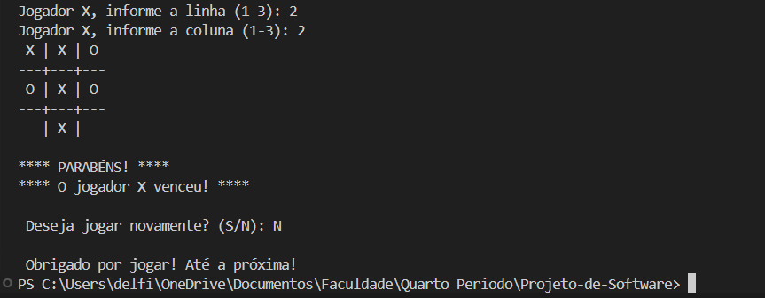

# 🏆 Jogo da Velha - Refatoração com Strategy
Este projeto é uma **refatoração** de um jogo da velha simples em Java. O código original concentrava toda a lógica na classe `Main.java`, tornando-o **difícil de manter** e pouco modular.  
Nesta refatoração, aplicamos **boas práticas de POO** e o **padrão Strategy** para melhorar a organização e a reutilização do código.

---

## 📌 Refatoração: O que foi Melhorado?
### **1️⃣ Separação de Responsabilidades (SRP - Single Responsibility Principle)**
Antes: Toda a lógica estava dentro da `Main.java`, misturando **regras do jogo**, **interação do usuário** e **verificação de vitória**.  
Agora: Criamos classes separadas seguindo a **arquitetura MVC**.

---

### **2️⃣ Implementação do Padrão Strategy**
Antes: A lógica de verificação de vitória era rígida e estava acoplada à `Main.java`.  
Agora: Implementamos o **padrão Strategy**, criando classes específicas para verificar vitórias por **linha, coluna e diagonal**.

```java
private boolean verificarVitoria() {
    char simbolo = jogador.getSimboloAtual();
    for (EstrategiaVitoria estrategia : estrategiasVitoria) {
        if (estrategia.verificar(tabuleiro, simbolo)) {
            return true;
        }
    }
    return false;
}
```
Isso torna mais fácil adicionar novas regras de vitória, se necessário.

---

### **3️⃣ Substituição da Matriz `char[][]` por uma Estrutura Orientada a Objetos**
Antes: O tabuleiro era representado como uma matriz char[][], dificultando a manipulação.
Agora: Criamos uma classe Celula e usamos uma lista de células (List<Celula>), tornando o código mais modular.

---

### **4️⃣ Organização do Código em Pacotes**
Agora, o código está organizado de forma modular e escalável, seguindo a estrutura:

# Jogo da Velha
    ├── 📂 refatorado 
        ├── 📂 controller
        │   ├── JogoDaVelha.java
        ├── 📂 models 
        │   ├── Celula.java 
        │   ├── Jogador.java
        │   ├── Tabuleiro.java
        ├── 📂 strategies 
        │   ├── EstrategiaVitoria.java
        │   ├── VitoriaLinha.java
        │   ├── VitoriaColuna.java
        │   ├── VitoriaDiagonal.java
        ├── Main.java

---

## 🚀 Como executar

### Pré-requisitos
- Certifique-se de ter o [Java Development Kit (JDK)](https://www.oracle.com/java/technologies/javase-jdk11-downloads.html) instalado (versão 11 ou superior).
- Um ambiente de desenvolvimento integrado (IDE) como [IntelliJ IDEA](https://www.jetbrains.com/idea/download/) ou [Eclipse](https://www.eclipse.org/downloads/).

### Passos para execução

1. **Clone o repositório:**
   ```bash
   git clone https://github.com/seu-usuario/seu-repositorio.git
   ```
2. **Navegue até o diretório do projeto:**
   ```bash
   cd seu-repositorio
   ```
3. **Compile o projeto:**
   - Se estiver usando a linha de comando:
     ```bash
     javac -d bin src/refatorado/**/*.java
     ```
   - Se estiver usando uma IDE, importe o projeto e deixe a IDE compilar automaticamente.

4. **Execute o programa:**
   - Se estiver usando a linha de comando:
     ```bash
     java -cp bin refatorado.Main
     ```
   - Se estiver usando uma IDE, execute a classe `Main.java` diretamente.

    **Ou então você pode baixar o ZIP:**

    - Para baixar o ZIP:

     - Vá até o repositório [Repositório de Projeto de Software](https://github.com/JuliaMedeir0s/Projeto-de-Software)
     - Clique em "Code" e depois em "Download ZIP"
     - Extraia o conteúdo do ZIP em um diretório de sua escolha

Pronto! Agora você deve ver o jogo da velha rodando no seu terminal ou console da IDE.

---

## O Jogo

O Jogo da Velha é um jogo de estratégia para dois jogadores, geralmente disputado em um tabuleiro 3x3. O objetivo é formar uma linha reta com três símbolos iguais (X ou O) na horizontal, vertical ou diagonal antes do adversário. Se todas as casas forem preenchidas sem que nenhum jogador complete uma linha, o jogo termina em empate.

### Tela 1️⃣ - Inicio

 


### Tela 2️⃣ - Jogador X e 0 escolhendo suas posições

 


### Tela 3️⃣ - Posição inválida




### Tela 4️⃣ - Jogo empatado




### Tela 5️⃣ - Final do Jogo




## 👥 Membros da Equipe
- Gustavo Delfino - (GitHub: @JuliaMedeir0s)
- Júlia Medeiros - (GitHub: @gdelfino01)
