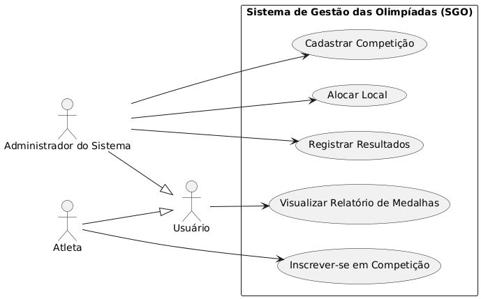
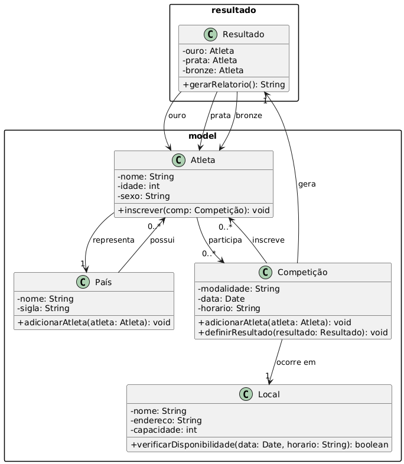
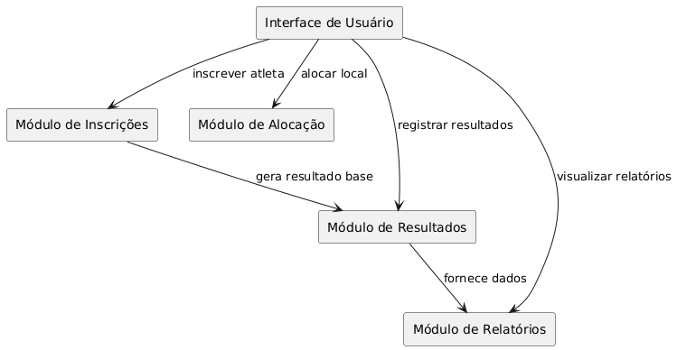
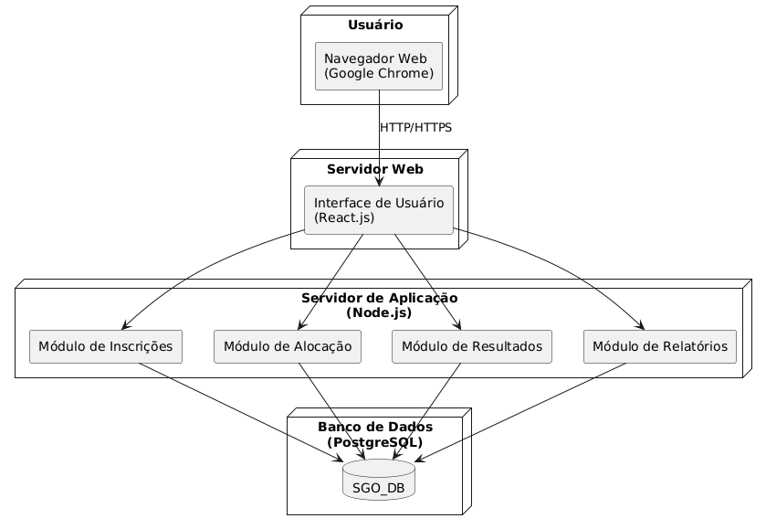

# Sistema de Gestão das Olimpíadas (SGO)

Este repositório contém a modelagem do Sistema de Gestão das Olimpíadas (SGO), desenvolvida para a disciplina de Projeto de Software.

## 🎯 Objetivo

O sistema visa permitir o gerenciamento completo das competições das Olimpíadas, incluindo:

- Cadastro de Competições
- Inscrição de Atletas
- Alocação de Locais
- Controle de Resultados
- Relatórios de Medalhas por País

---

### 📂 Estrutura do Repositório
```
├── README.md
├── imagens/
│   ├── diagrama-casos-de-uso.png
│   ├── diagrama-classes-pacote.png
│   ├── diagrama-componentes.png
│   └── diagrama-implantacao.png
├── modelagens/
│   ├── plantuml-codigos.md
```
---

## 📌 Histórias de Usuário

- Como administrador do sistema, quero cadastrar competições informando modalidade, data, horário, local e atletas inscritos, para que o evento seja corretamente agendado e organizado.
- Como atleta, quero me inscrever em competições específicas, para que eu possa participar das modalidades desejadas representando meu país.
- Como administrador do sistema, quero alocar locais para as competições evitando conflitos, para garantir que cada competição ocorra sem problemas.
- Como administrador do sistema, quero registrar os resultados das provas, para que os vencedores sejam definidos e armazenados.
- Como usuário, quero visualizar relatórios de medalhas por país, para acompanhar o desempenho geral nas Olimpíadas.

---

## 🖼️ Diagramas UML

### Diagrama de Casos de Uso



### Diagrama de Classes e Pacotes



### Diagrama de Componentes



### Diagrama de Implantação



---

## 👥 Autores

- Gustavo Delfino - (GitHub: @JuliaMedeir0s)
- Júlia Medeiros - (GitHub: @gdelfino01)
